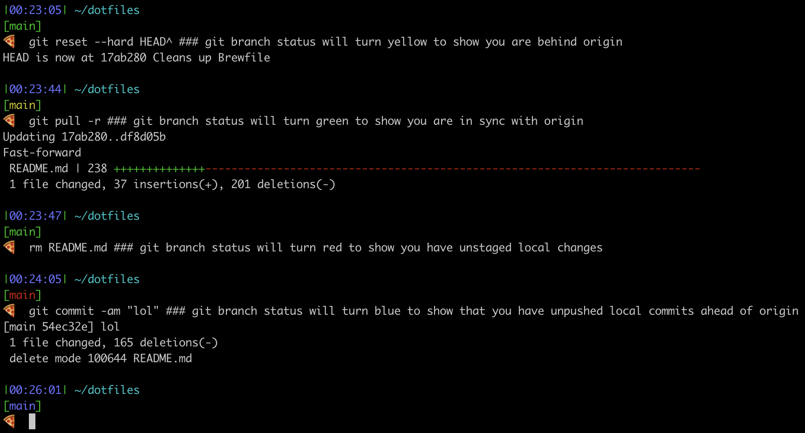

⏣SUPERIOR ULTRABEST™⏣ bash/git/vim configuration dotfiles for 1337 \*NIX H4X025 (plus _safe_ install script).

## Install dotfiles
```bash
git clone git@github.com:mitochondrion/dotfiles.git ~/.dotfiles
cd ~/.dotfiles
./install_dotfiles.sh # Don't worry, this will preserve existing dotfiles with timestamps!
source ~/.bash_profile # Apply new dotfiles to current shell
```

## Bash prompt
Fancy bash prompt (with bonus pizza!) designed for legibility and speed, including timestamp, path, local git branch/status, and current python venv. Git branch status colors explained in below screenshot:


## Setup Vim
```bash
### Install dotfile (if you didn't install all dotfiles above)
mv ~/.vimrc ~/.vimrc.`date "+%Y%m%d%H%M%S"` # Just in case...
wget https://raw.githubusercontent.com/mitochondrion/dotfiles/master/.vimrc -O ~/.vimrc

### Install Pathogen
mkdir -p ~/.vim/autoload ~/.vim/bundle && \
curl -LSso ~/.vim/autoload/pathogen.vim https://tpo.pe/pathogen.vim

### Install plugins
git clone https://github.com/scrooloose/nerdcommenter.git ~/.vim/bundle/nerdcommenter
git clone https://github.com/scrooloose/nerdtree.git ~/.vim/bundle/nerdtree
git clone https://github.com/airblade/vim-gitgutter ~/.vim/bundle/vim-gitgutter
git clone https://github.com/mileszs/ack.vim.git ~/.vim/bundle/ack.vim
git clone https://github.com/bronson/vim-trailing-whitespace ~/.vim/bundle/vim-trailing-whitespace
git clone https://github.com/ctrlpvim/ctrlp.vim.git ~/.vim/bundle/ctrlp.vim
git clone https://github.com/ervandew/supertab ~/.vim/bundle/supertab
git clone https://github.com/ntpeters/vim-better-whitespace.git ~/.vim/bundle/vim-better-whitespace
git clone https://github.com/sheerun/vim-polyglot.git ~/.vim/bundle/vim-polyglot
git clone https://github.com/tpope/vim-fugitive.git ~/.vim/bundle/vim-fugitive
git clone https://github.com/rking/ag.vim.git ~/.vim/bundle/ag.vim
# git clone https://github.com/scrooloose/syntastic ~/.vim/bundle/syntastic # 🐌Removed because Syntastic can make vim unuseably slow

# Install Vim colors
mkdir -p ~/.vim/colors
git clone https://github.com/chriskempson/tomorrow-theme.git ~/.vim/colors/tomorrow-theme
cp ~/.vim/colors/tomorrow-theme/vim/colors/*.vim ~/.vim/colors/
```

## Setup VSCode
Fix vim-mode key repeating
```bash
defaults write com.microsoft.VSCode ApplePressAndHoldEnabled -bool false
```

## Setup new OSX install
Use the below commands to set up a new instance of OSX and the associated tools/applications. Mix and match at your heart's desire!

```bash
### Command-line tools
xcode-select --install

### Fix OSX defaults
# Set new hostname
sudo scutil --set HostName [new hostname]

# Display full path and all files in Finder
defaults write com.apple.finder AppleShowAllFiles -boolean true
defaults write com.apple.finder _FXShowPosixPathInTitle -bool YES

# Setup screenshots directory
mkdir ~/Documents/Screenshots
defaults write com.apple.screencapture location ~/Documents/Screenshots
killall Finder

# Set a super fast keyboard repeat rate
defaults write NSGlobalDomain KeyRepeat -int 0.02

# Set a shorter Delay until key repeat
defaults write NSGlobalDomain InitialKeyRepeat -int 12

# Turn on three-finger-drag
defaults -currentHost write NSGlobalDomain com.apple.trackpad.threeFingerSwipeGesture -int 1

# Create workspace directory
mkdir ~/workspace

### Fix OSX Dock
# Show hidden apps
defaults write com.apple.dock showhidden -bool yes
# Speed up animations
defaults write com.apple.dock autohide-time-modifier -float 0.5
# Show only running apps
defaults write com.apple.dock static-only -bool true
# Restart Dock to load changes
killall Dock

# === No longer scriptable ===
# Set mouse tracking speed
# Hide dock
# Remove default apps from Dock
# Hide menu bar
# Turn on trackpad tap-to-click
# Turn on OSX Dark Mode

### Homebrew
# After installs, search terminal output for “==> Caveats” for post-brew instructions
#For up-to-date formulae, check https://formulae.brew.sh/
# For up-to-date cask formulae, check https://github.com/Homebrew/homebrew-cask/tree/master/Casks
ruby -e "$(curl -fsSL https://raw.githubusercontent.com/Homebrew/install/master/install)"
brew update
brew tap caskroom/cask
brew tap homebrew/cask-drivers
brew tap caskroom/versions
brew install wget

# Command line tools
brew install ag
brew install pv
brew install tree
brew install gawk
brew install wget
brew install openssl
brew install gpg
brew install httpie
brew install unrar
brew install unar
brew install calc
brew install htop
brew install geoip
brew install hh
brew install links
brew install lynx
brew install ncdu
brew install nmap
brew install speedtest_cli
brew install f3
brew install findutils
brew install fortune
brew install sox # play -n synth 5 sine 440
brew install ffmpeg
brew install watch
brew install macvim
brew install gnu-go
brew install f3
brew install testdisk
brew install mdp

# Languages
brew install node
brew install python # Now defaults to python 3
brew install python2
brew install r
chmod -R u+w /usr/local/Cellar/r # As of 11/20/2018 the Homebrew R installation doesn't set the proper permissions for installing CRAN packages
brew install ruby
brew install go
brew install kotlin
brew cask install java

# Dev tools
brew install gcc # Can take FOREVER (~1 hour)
brew install git
brew install ctags
brew install gradle
brew install pgcli
brew install jq
brew install chromedriver
brew install postman
brew install charles
brew install rstudio
brew install android-studio
brew install intellij-idea
brew install pycharm-ce
brew install visual-studio-code
brew install ngrok
brew install dbeaver
# brew install phantomjs # PhantomJs deprecated in favor of headless Chrome/Firefox

# Infrastructure/devops
brew install postgres
brew install mysql
brew install redis
brew install heroku/brew/heroku
brew install awscli
brew install google-cloud-sdk
brew install docker # Install this instead of all the individual docker packages below
# brew install docker
# brew install docker-compose
# brew install docker-machine
# brew install docker-completion
# brew install docker-compose-completion
# brew install docker-machine-completion

# Desktop apps
brew install keepassxc
brew install iterm2
brew install eqmac
brew install flux
brew install google-chrome
brew install brave-browser
# brew install google-chrome-canary
brew install firefox
brew install grandperspective
brew install menumeters
brew install slack
brew install sloth
brew install spotify
brew install sonos
brew install pocket-casts
brew install steam
brew install textmate
brew install vlc
brew install menubar-countdown
brew install accessmenubarapps
brew install imagej
brew install google-earth
brew install chromecast
brew install time-out
brew install whatsapp
brew install MacDown
brew install sabaki
brew install spectacle
brew install whatsapp
brew install signal
brew install discord
# brew install shiftit # Replaced by spectacle. Also I prefer the old Shiftit hotkeys anyway: https://github.com/mitochondrion/dotfiles/raw/master/ShiftIt.app.zip (mirror of https://github.com/downloads/onsi/ShiftIt/ShiftIt.app.zip)

# Defunct formulae?
# brew install sonos
# brew install wunderlist

# Homebrew cleanup
brew cleanup -s
brew doctor

### Install dotfiles
git clone git@github.com:mitochondrion/dotfiles.git ~/.dotfiles
cd ~/.dotfiles
./install_dotfiles.sh # Don't worry, this will preserve existing dotfiles with timestamps!
source ~/.bash_profile # Apply new dotfiles to current shell

### iTerm2 configs
# load iterm3_config.json iTerm2 3.0 configs manually via iTerm preferences menu

# DEPRECATED 2.0 METHOD
# wget https://raw.githubusercontent.com/mitochondrion/dotfiles/master/com.googlecode.iterm2.plist -O ~/Library/Preferences/com.googlecode.iterm2.plist

### NPM
npm install -g vtop
npm install -g json-minify

# Optional packages
# brew cask install sequel-pro

### PIP
# sudo easy_install pip # Unnecessary due to "brew install python"
pip3 install --upgrade pip setuptools wheel
pip install --upgrade pip setuptools
pip3 install --user --upgrade awscli
pip3 install requests
pip install requests
pip3 install pylint
pip install pylint
pip install numpy
pip3 install numpy
pip install ipython
pip3 install ipython
pip install jupyter
pip3 install jupyter
pip install jupyterthemes
pip3 install jupyterthemes
pip install pandas
pip3 install pandas
pip install scikit-learn
pip3 install scikit-learn
pip3 install altair
pip3 install vega_datasets
pip3 install hvplot

brew install gfortran
pip install scipy
pip3 install scipy

brew install pkg-config
pip install matplotlib
pip3 install matplotlib

### VIM
# Vim plugins (using Pathogen)
mkdir -p ~/.vim/autoload ~/.vim/bundle && \
curl -LSso ~/.vim/autoload/pathogen.vim https://tpo.pe/pathogen.vim
git clone https://github.com/scrooloose/nerdcommenter.git ~/.vim/bundle/nerdcommenter
git clone https://github.com/scrooloose/nerdtree.git ~/.vim/bundle/nerdtree
git clone https://github.com/airblade/vim-gitgutter ~/.vim/bundle/vim-gitgutter
git clone https://github.com/mileszs/ack.vim.git ~/.vim/bundle/ack.vim
git clone https://github.com/bronson/vim-trailing-whitespace ~/.vim/bundle/vim-trailing-whitespace
git clone https://github.com/ctrlpvim/ctrlp.vim.git ~/.vim/bundle/ctrlp.vim
git clone https://github.com/ervandew/supertab ~/.vim/bundle/supertab
git clone https://github.com/ntpeters/vim-better-whitespace.git ~/.vim/bundle/vim-better-whitespace
git clone https://github.com/sheerun/vim-polyglot.git ~/.vim/bundle/vim-polyglot
git clone https://github.com/tpope/vim-fugitive.git ~/.vim/bundle/vim-fugitive
# git clone https://github.com/scrooloose/syntastic ~/.vim/bundle/syntastic # 🐌Removed because Syntastic can make vim unuseably slow

# Vim colors
mkdir ~/.vim/colors
git clone https://github.com/chriskempson/tomorrow-theme.git ~/.vim/colors/tomorrow-theme
cp ~/.vim/colors/tomorrow-theme/vim/colors/*.vim ~/.vim/colors/

# XCode
sudo gem install cocoapods
mkdir ~/Library/Developer/Xcode/UserData/FontAndColorThemes
wget https://raw.githubusercontent.com/mitochondrion/XcodePreferences/master/FontAndColorThemes/akitchen_12.dvtcolortheme -O ~/Library/Developer/Xcode/UserData/FontAndColorThemes/akitchen_12.dvtcolortheme

# === Other Stuff ===
# https://github.com/downloads/onsi/ShiftIt/ShiftIt.app.zip (Old version had better hotkeys)
# http://www.dejal.com/timeout/
# http://member.ipmu.jp/yuji.tachikawa/MenuMetersElCapitan/
# Wunderlist
# Sonos

# === Browser Plugins ===
# https://github.com/mitochondrion/notes/wiki/Browser-Plugins
```
