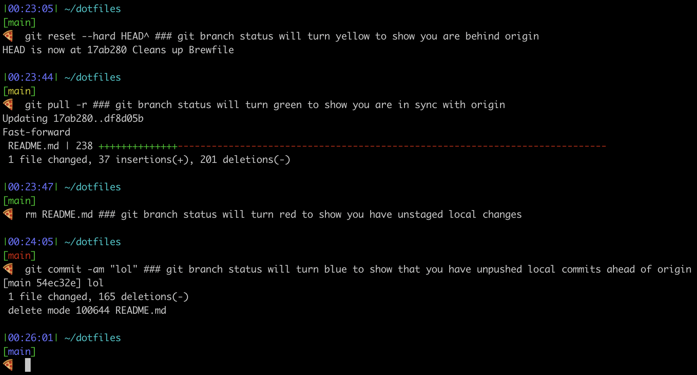

⏣SUPERIOR ULTRABEST™⏣ bash/git/vim/whatever configuration dotfiles for 1337 \*NIX H4X025 (plus _safe_ install script).

## Install dotfiles
```bash
git clone git@github.com:mitochondrion/dotfiles.git ~/.dotfiles
cd ~/.dotfiles
./install_dotfiles.sh # Don't worry, this will preserve existing dotfiles with timestamps!
source ~/.bash_profile # Apply new dotfiles to current shell
```

## Bash prompt
Fancy bash prompt (with bonus pizza!) designed for legibility and speed, including timestamp, path, local git branch/status, and current python venv. Git branch status colors explained in below screenshot:


## Setup Vim
> [!NOTE]
> Install dotfiles first [here](#install-dotfiles).

### Install Pathogen and plugins
```bash
# Pathogen
mkdir -p ~/.vim/autoload ~/.vim/bundle && \
curl -LSso ~/.vim/autoload/pathogen.vim https://tpo.pe/pathogen.vim

# Plugins
git clone https://github.com/scrooloose/nerdcommenter.git ~/.vim/bundle/nerdcommenter
git clone https://github.com/scrooloose/nerdtree.git ~/.vim/bundle/nerdtree
git clone https://github.com/airblade/vim-gitgutter ~/.vim/bundle/vim-gitgutter
git clone https://github.com/mileszs/ack.vim.git ~/.vim/bundle/ack.vim
git clone https://github.com/bronson/vim-trailing-whitespace ~/.vim/bundle/vim-trailing-whitespace
git clone https://github.com/ctrlpvim/ctrlp.vim.git ~/.vim/bundle/ctrlp.vim
git clone https://github.com/ervandew/supertab ~/.vim/bundle/supertab
git clone https://github.com/ntpeters/vim-better-whitespace.git ~/.vim/bundle/vim-better-whitespace
git clone https://github.com/sheerun/vim-polyglot.git ~/.vim/bundle/vim-polyglot
git clone https://github.com/tpope/vim-fugitive.git ~/.vim/bundle/vim-fugitive
git clone https://github.com/rking/ag.vim.git ~/.vim/bundle/ag.vim
# git clone https://github.com/scrooloose/syntastic ~/.vim/bundle/syntastic # 🐌 Removed because Syntastic can make vim unuseably slow
```

### Install Vim colors
```bash
mkdir -p ~/.vim/colors
git clone https://github.com/chriskempson/tomorrow-theme.git ~/.vim/colors/tomorrow-theme
cp ~/.vim/colors/tomorrow-theme/vim/colors/*.vim ~/.vim/colors/
```

## Setup Mac
Use the below commands to set up a new instance of OSX and the associated tools/applications. Mix and match at your heart's desire!

> [!NOTE]
> Install dotfiles first [here](#install-dotfiles).

### OS setup
```bash
### Command-line tools
xcode-select --install

### Fix OSX defaults
# Set new hostname
sudo scutil --set HostName [new hostname]

# Display full path and all files in Finder
defaults write com.apple.finder AppleShowAllFiles -boolean true
defaults write com.apple.finder _FXShowPosixPathInTitle -bool YES

# Setup screenshots directory
mkdir ~/Documents/Screenshots
defaults write com.apple.screencapture location ~/Documents/Screenshots
killall Finder

# Set a super fast keyboard repeat rate
defaults write NSGlobalDomain KeyRepeat -int 0.02

# Set a shorter Delay until key repeat
defaults write NSGlobalDomain InitialKeyRepeat -int 12

# Turn off char key hold menu
defaults write -g ApplePressAndHoldEnabled -bool false

# Turn on three-finger-drag
defaults -currentHost write NSGlobalDomain com.apple.trackpad.threeFingerSwipeGesture -int 1

# Create workspace directory
mkdir ~/workspace

### Fix OSX Dock
# Show hidden apps
defaults write com.apple.dock showhidden -bool yes
# Speed up animations
defaults write com.apple.dock autohide-time-modifier -float 0.5
# Show only running apps
defaults write com.apple.dock static-only -bool true
# Restart Dock to load changes
killall Dock

# Fix VSCode vim-mode key repeating
defaults write com.microsoft.VSCode ApplePressAndHoldEnabled -bool false
```

### No longer scriptable
- Set mouse tracking speed
- Hide dock
- Remove default apps from Dock
- Hide menu bar
- Turn on trackpad tap-to-click
- Turn on OSX Dark Mode

### Homebrew
Clone or install `Brewfile` from this repo via install script.
```bash
ruby -e "$(curl -fsSL https://raw.githubusercontent.com/Homebrew/install/master/install)"
brew update
brew bundle --file=~/Brewfile
```

### Configure iTerm
Load `iterm3_config.json` configs manually via iTerm preferences menu.

### Misc installs
- https://github.com/doersino/vol

## Browser Plugins
https://github.com/mitochondrion/notes/wiki/Browser-Plugins

## Package installs
[TODO: Replace this setcion with package files] 
```bash
### NPM
npm install -g vtop
npm install -g json-minify

### PIP
# sudo easy_install pip # Unnecessary due to "brew install python"
pip3 install --upgrade pip setuptools wheel
pip install --upgrade pip setuptools
pip3 install --user --upgrade awscli
pip3 install requests
pip install requests
pip3 install pylint
pip install pylint
pip install numpy
pip3 install numpy
pip install ipython
pip3 install ipython
pip install jupyter
pip3 install jupyter
pip install jupyterthemes
pip3 install jupyterthemes
pip install pandas
pip3 install pandas
pip install scikit-learn
pip3 install scikit-learn
pip3 install altair
pip3 install vega_datasets
pip3 install hvplot

brew install gfortran
pip install scipy
pip3 install scipy

brew install pkg-config
pip install matplotlib
pip3 install matplotlib
```
